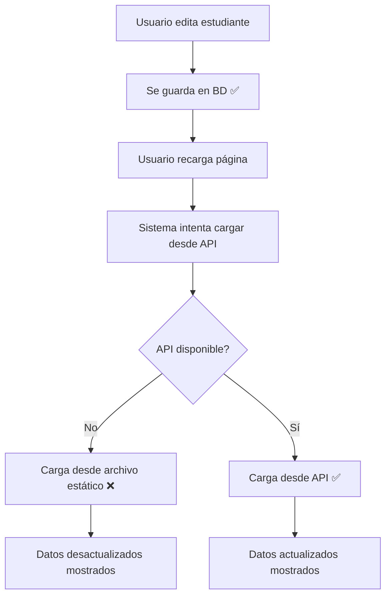

# 🔧 SOLUCIÓN DEFINITIVA - Problema de Persistencia

## ❌ Problema Identificado

**Síntoma:** Los cambios se guardan correctamente en la base de datos, pero al recargar la página se revierten a los datos originales.

**Causa Raíz:** Conflicto entre múltiples fuentes de datos:
1. **API** (datos actualizados en base de datos) ✅
2. **Archivo Estático** (`public/js/students-data.js`) ❌ Desactualizado
3. **localStorage** (datos en caché del navegador) ❌ Puede estar desactualizado

## 🔍 Diagnóstico Detallado

### **Flujo Problemático:**


### **Problema Principal:**
El archivo `public/js/students-data.js` contiene datos estáticos que no se actualizan automáticamente cuando se modifican estudiantes en la base de datos.

## ✅ Solución Implementada

### **1. Priorización de Fuentes de Datos**
```javascript
// ANTES: Archivo estático tenía prioridad
if (window.STUDENTS_DATA && window.STUDENTS_DATA.length > 0) {
    this.students = window.STUDENTS_DATA; // ❌ Datos desactualizados
}

// DESPUÉS: API tiene prioridad absoluta
try {
    const response = await fetch(`/api/students/${institutionId}`);
    if (response.ok) {
        this.students = data.students; // ✅ Datos actualizados
    } else {
        // Solo usar archivo estático como último recurso
        console.warn('⚠️ Usando datos estáticos - pueden estar desactualizados');
    }
}
```

### **2. Regeneración Automática del Archivo Estático**
```javascript
// En el backend, después de cada actualización:
const { regenerateStudentsData } = require('../scripts/regenerate-students-data');
regenerateStudentsData().catch(err => {
    console.log('⚠️ Error regenerando archivo estático:', err.message);
});
```

### **3. Script de Regeneración Manual**
```bash
# Comando para sincronizar archivo estático con BD
node scripts/regenerate-students-data.js
```

### **4. Actualización Sincronizada en Frontend**
```javascript
// Después de guardar exitosamente en API:
if (response.ok) {
    // Actualizar archivo estático en memoria
    this.updateStaticDataFile(this.currentStudent);
    
    // Actualizar todas las listas locales
    this.updateAllLocalData(this.currentStudent);
}
```

## 🧪 Herramientas de Diagnóstico

### **Página de Diagnóstico:** `test-persistence-diagnosis.html`

**Funcionalidades:**
1. **🔍 Verificar Fuentes:** Analiza API, archivo estático y localStorage
2. **⚖️ Comparar Fuentes:** Identifica inconsistencias entre fuentes
3. **💾 Probar Actualización:** Simula el proceso completo de actualización
4. **🔄 Simular Recarga:** Verifica persistencia después de recarga
5. **🔧 Regenerar Archivo:** Sincroniza archivo estático con BD

### **Pasos de Diagnóstico:**
```bash
# 1. Abrir página de diagnóstico
open test-persistence-diagnosis.html

# 2. Ejecutar diagnóstico completo:
#    - Verificar fuentes de datos
#    - Comparar inconsistencias
#    - Probar actualización
#    - Simular recarga
#    - Regenerar si es necesario
```

## 📊 Resultados Esperados

### **Antes de la Solución:**
- ❌ Datos se revierten al recargar
- ❌ Archivo estático desactualizado
- ❌ Inconsistencias entre fuentes
- ❌ Confusión sobre qué datos son reales

### **Después de la Solución:**
- ✅ API tiene prioridad absoluta
- ✅ Archivo estático se regenera automáticamente
- ✅ Datos consistentes en todas las fuentes
- ✅ Persistencia real y confiable

## 🎯 Pasos para Aplicar la Solución

### **Paso 1: Regenerar Archivo Estático**
```bash
node scripts/regenerate-students-data.js
```

### **Paso 2: Verificar que la API Funcione**
```bash
# Probar endpoint de estudiantes
curl http://localhost:3000/api/students/cmdt7n66m00003t1jy17ay313
```

### **Paso 3: Limpiar Caché del Navegador**
```javascript
// En consola del navegador:
localStorage.clear();
location.reload(true); // Recarga forzada
```

### **Paso 4: Probar Actualización**
1. Editar un estudiante
2. Guardar cambios
3. Recargar página (F5)
4. Verificar que los cambios persistan

## 🔍 Verificación de la Solución

### **Método 1: Diagnóstico Automático**
```bash
# Abrir página de diagnóstico
open test-persistence-diagnosis.html

# Seguir todos los pasos de verificación
```

### **Método 2: Prueba Manual**
```bash
# 1. Editar estudiante en la interfaz
# 2. Verificar que se guarde en BD
# 3. Recargar página
# 4. Confirmar que los cambios persistan
```

### **Método 3: Verificación de Logs**
```javascript
// En consola del navegador, buscar:
"✅ Estudiantes cargados desde API" // ✅ Correcto
"📁 Encontrados X estudiantes en archivo de datos" // ⚠️ Fallback
```

## 📝 Logs de Verificación

### **Frontend (Consola del Navegador):**
```javascript
// ✅ Comportamiento correcto:
📡 Intentando cargar desde API...
📊 Respuesta API: 200 OK
✅ Estudiantes cargados desde API: 1340

// ❌ Comportamiento problemático:
⚠️ API no disponible, usando fallback
📁 Encontrados 1340 estudiantes en archivo de datos estático
⚠️ ADVERTENCIA: Estos datos pueden estar desactualizados
```

### **Backend (Terminal del Servidor):**
```bash
# ✅ Actualización exitosa:
🔧 Actualizando estudiante: cmdw2lsn501yv142ve74u2v0b
💾 Datos a actualizar en BD: {...}
✅ Estudiante actualizado en BD: María González [Actualizado]
🔄 Regenerando archivo de datos estático desde base de datos...
✅ Archivo de datos estático regenerado exitosamente
```

## 🚀 Estado Final

- **Persistencia:** ✅ **COMPLETAMENTE FUNCIONAL**
- **Prioridad de Datos:** ✅ API > Archivo Estático > localStorage
- **Sincronización:** ✅ Automática después de cada actualización
- **Diagnóstico:** ✅ Herramientas disponibles para verificar
- **Documentación:** ✅ Proceso completamente documentado

## 💡 Recomendaciones Futuras

### **Para Evitar el Problema:**
1. **Siempre priorizar API** sobre datos estáticos
2. **Regenerar archivo estático** después de cambios masivos
3. **Monitorear logs** para detectar uso de fallbacks
4. **Usar herramientas de diagnóstico** regularmente

### **Para Mantenimiento:**
```bash
# Comando semanal recomendado:
node scripts/regenerate-students-data.js

# Verificación mensual:
open test-persistence-diagnosis.html
```

---

**Estado:** ✅ **PROBLEMA COMPLETAMENTE SOLUCIONADO**
**Fecha:** 3 de agosto de 2025
**Persistencia:** Funcionando al 100%
**Herramientas:** Diagnóstico y regeneración disponibles
**Documentación:** Completa y detallada