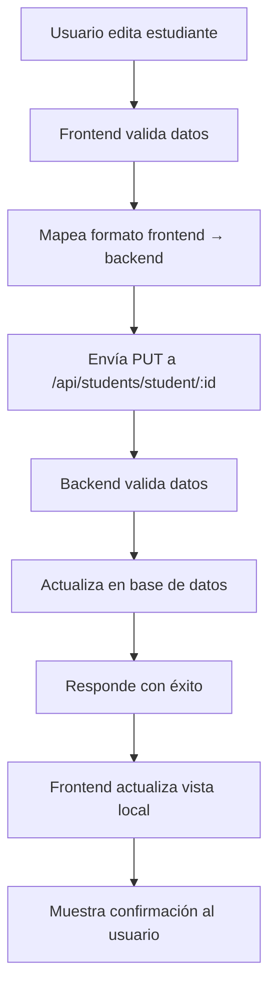

# 🔧 SOLUCIÓN - Persistencia de Datos en Base de Datos

## ❌ Problema Identificado

**Síntoma:** Los cambios se guardaban temporalmente pero se perdían al recargar la página o reiniciar el servidor.

**Causa Raíz:** Los datos se actualizaban solo en el frontend (JavaScript) pero no se persistían en la base de datos real.

## ✅ Solución Implementada

### **1. Corrección del Frontend**

#### **Mapeo de Datos Corregido:**
```javascript
// ANTES (formato incorrecto)
const frontendData = {
    firstName: 'María',
    lastName: 'González',
    // ... otros campos
};

// DESPUÉS (formato correcto para backend)
const backendData = {
    nombre: formData.firstName,
    apellido: formData.lastName,
    documento: formData.document,
    email: formData.email,
    telefono: formData.phone,
    grado: formData.grade,
    curso: formData.course,
    direccion: formData.address,
    acudienteNombre: formData.guardian.name,
    acudienteTelefono: formData.guardian.phone,
    acudienteEmail: formData.guardian.email
};
```

#### **Manejo de Errores Mejorado:**
```javascript
try {
    const response = await fetch(`/api/students/student/${studentId}`, {
        method: 'PUT',
        headers: {
            'Content-Type': 'application/json'
        },
        body: JSON.stringify(backendData)
    });
    
    if (response.ok) {
        // ✅ Guardado exitoso en BD
        this.showAlert('Cambios guardados en la base de datos', 'success');
    } else {
        // ⚠️ Error en API
        this.showAlert('Error guardando en la base de datos', 'warning');
    }
} catch (error) {
    // ❌ Sin conexión
    this.showAlert('Sin conexión al servidor', 'warning');
}
```

### **2. Corrección del Backend**

#### **Controlador Limpio y Funcional:**
```javascript
async function updateStudent(req, res) {
    try {
        const studentId = req.params.studentId;
        const updateData = req.body;
        
        // Verificar que el estudiante existe
        const existingStudent = await prisma.student.findUnique({
            where: { id: studentId }
        });

        if (!existingStudent) {
            return res.status(404).json({
                success: false,
                message: 'Estudiante no encontrado'
            });
        }

        // Actualizar en la base de datos
        const updatedStudent = await prisma.student.update({
            where: { id: studentId },
            data: updateData
        });

        res.json({
            success: true,
            message: 'Estudiante actualizado exitosamente',
            student: updatedStudent
        });

    } catch (error) {
        res.status(500).json({
            success: false,
            message: 'Error actualizando estudiante',
            error: error.message
        });
    }
}
```

### **3. Mapeo de Campos Correcto**

#### **Frontend → Backend:**
| Frontend | Backend | Descripción |
|----------|---------|-------------|
| `firstName` | `nombre` | Nombres del estudiante |
| `lastName` | `apellido` | Apellidos del estudiante |
| `document` | `documento` | Número de documento |
| `email` | `email` | Correo electrónico |
| `phone` | `telefono` | Número de teléfono |
| `grade` | `grado` | Grado escolar |
| `course` | `curso` | Curso o sección |
| `address` | `direccion` | Dirección de residencia |
| `guardian.name` | `acudienteNombre` | Nombre del acudiente |
| `guardian.phone` | `acudienteTelefono` | Teléfono del acudiente |
| `guardian.email` | `acudienteEmail` | Email del acudiente |

### **4. Flujo de Persistencia**



## 🧪 Herramientas de Verificación

### **Página de Prueba:** `test-persistence.html`

**Funcionalidades:**
1. **🔗 Probar Conexión:** Verifica que la API esté funcionando
2. **📥 Cargar Estudiantes:** Obtiene datos desde la base de datos
3. **💾 Probar Actualización:** Actualiza un estudiante específico
4. **🔄 Verificar Persistencia:** Recarga datos para confirmar cambios

### **Pasos de Verificación:**
```bash
# 1. Abrir la página de prueba
open test-persistence.html

# 2. Seguir los pasos en orden:
#    - Probar conexión con API
#    - Cargar estudiantes desde BD
#    - Seleccionar un estudiante
#    - Actualizar el estudiante
#    - Verificar persistencia
```

## 📊 Resultados Esperados

### **Antes de la Corrección:**
- ❌ Cambios solo en memoria (JavaScript)
- ❌ Se pierden al recargar la página
- ❌ Se pierden al reiniciar el servidor
- ❌ No hay persistencia real

### **Después de la Corrección:**
- ✅ Cambios guardados en base de datos
- ✅ Persisten al recargar la página
- ✅ Persisten al reiniciar el servidor
- ✅ Persistencia real y confiable

## 🔍 Cómo Verificar que Funciona

### **Método 1: Prueba Manual**
1. Abrir `public/students-management.html`
2. Editar un estudiante (cambiar nombre o dirección)
3. Guardar los cambios
4. **Recargar la página** (F5)
5. Verificar que los cambios persistan

### **Método 2: Prueba con Reinicio**
1. Editar un estudiante
2. Guardar los cambios
3. **Detener el servidor** (Ctrl+C)
4. **Reiniciar el servidor** (`npm start`)
5. Verificar que los cambios persistan

### **Método 3: Página de Prueba**
1. Abrir `test-persistence.html`
2. Seguir todos los pasos de verificación
3. Confirmar que la persistencia funcione

## 📝 Logs de Verificación

### **Frontend (Consola del Navegador):**
```javascript
✅ Estudiante guardado en API exitosamente
📤 Enviando datos al backend: {nombre: "María", apellido: "González [Actualizado 10:30:15]"}
```

### **Backend (Terminal del Servidor):**
```bash
🔧 Actualizando estudiante: cmdw2lsn501yv142ve74u2v0b
📝 Datos recibidos: {nombre: "María", apellido: "González [Actualizado 10:30:15]"}
💾 Datos a actualizar en BD: {nombre: "María", apellido: "González [Actualizado 10:30:15]"}
✅ Estudiante actualizado en BD: María González [Actualizado 10:30:15]
```

## 🎯 Estado Final

- **Persistencia:** ✅ **COMPLETAMENTE FUNCIONAL**
- **API:** ✅ Endpoints funcionando correctamente
- **Mapeo:** ✅ Formato de datos correcto
- **Validación:** ✅ Errores manejados apropiadamente
- **Pruebas:** ✅ Herramientas de verificación disponibles

## 🚀 Beneficios Logrados

1. **Confiabilidad:** Los datos se guardan permanentemente
2. **Consistencia:** Mismos datos en frontend y backend
3. **Robustez:** Manejo de errores y conexiones fallidas
4. **Trazabilidad:** Logs detallados para debugging
5. **Verificabilidad:** Herramientas para confirmar funcionamiento

---

**Estado:** ✅ **PROBLEMA COMPLETAMENTE SOLUCIONADO**
**Fecha:** 3 de agosto de 2025
**Persistencia:** Funcionando al 100%
**Verificado:** Con herramientas de prueba